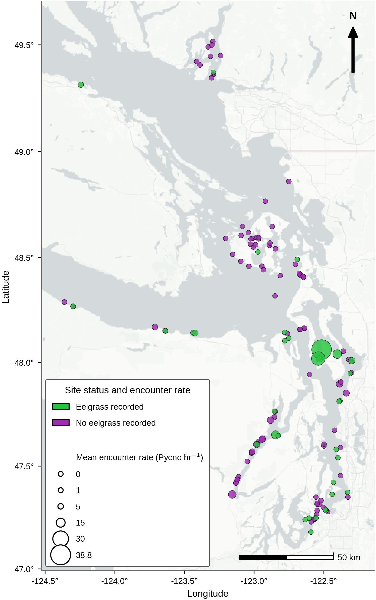
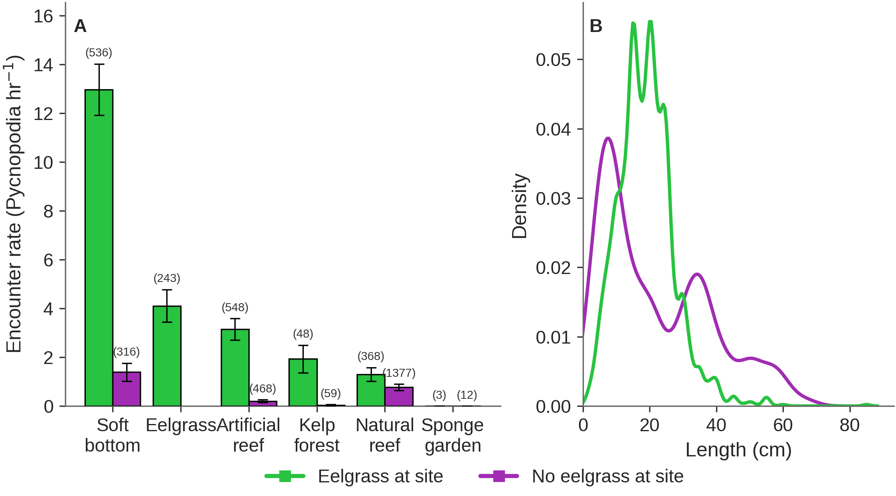
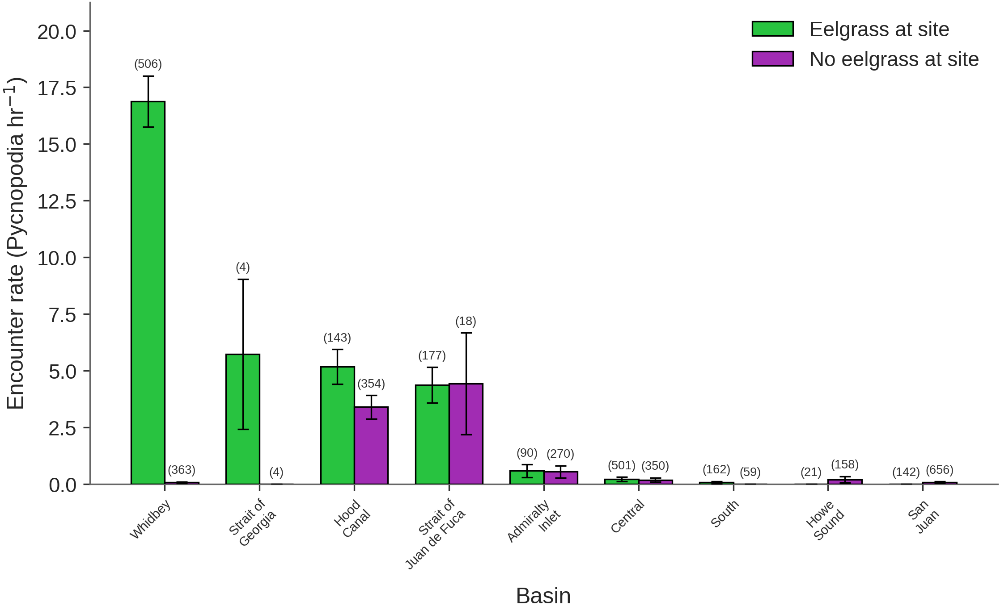
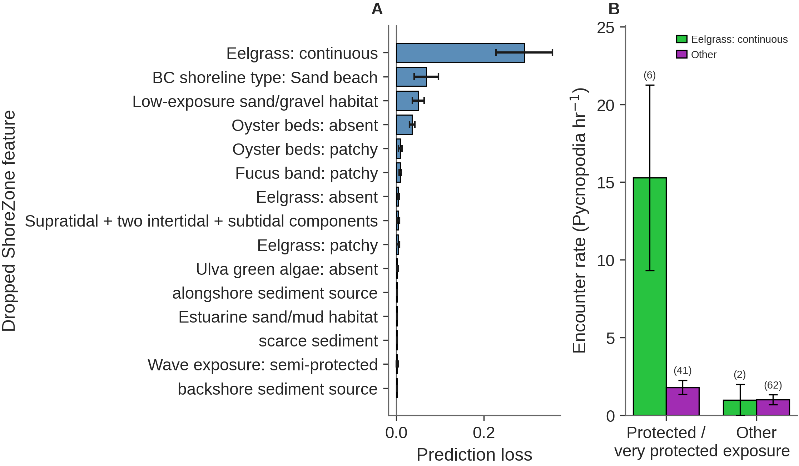
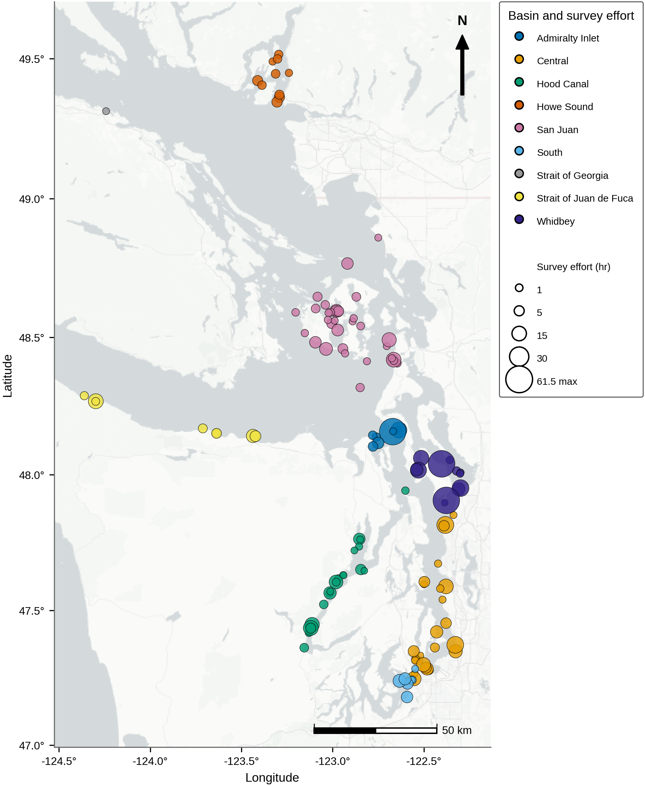
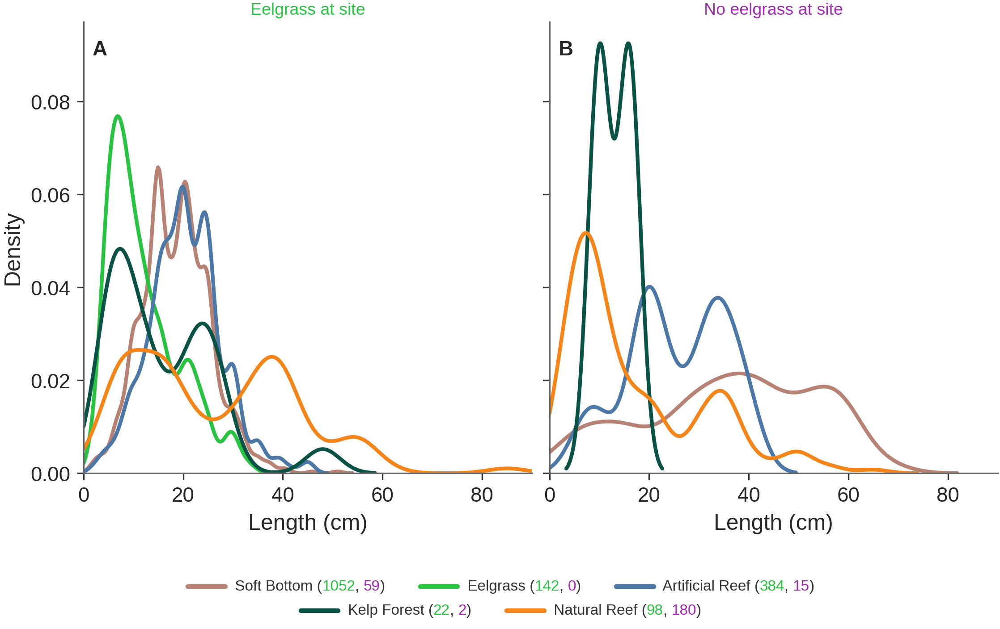
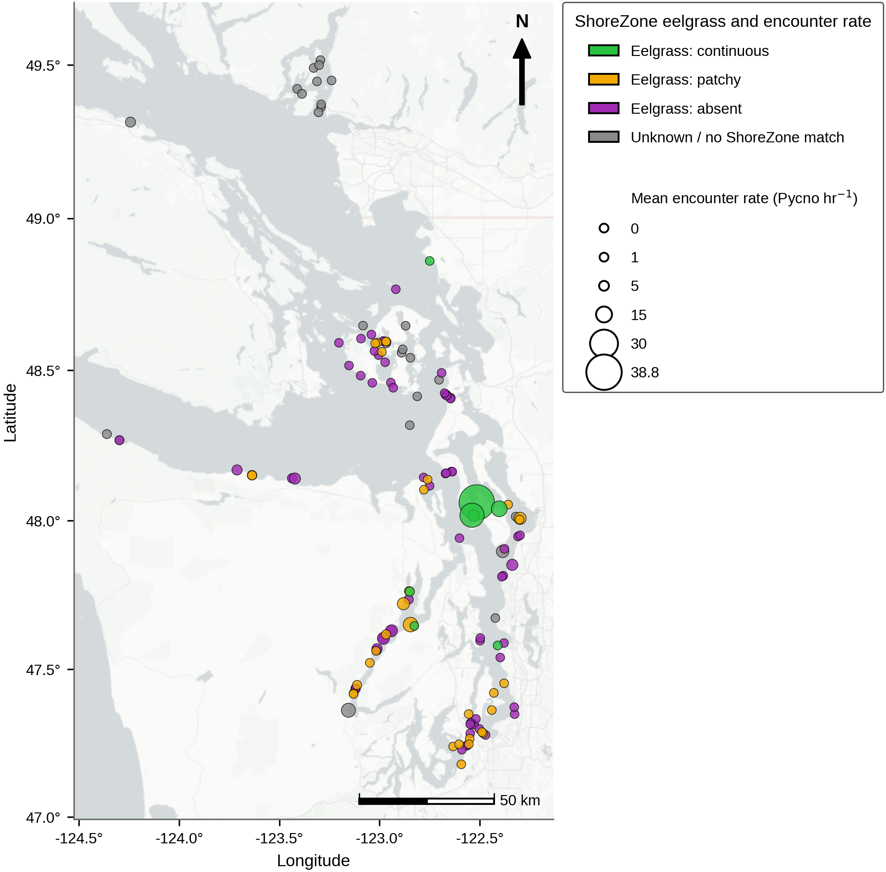
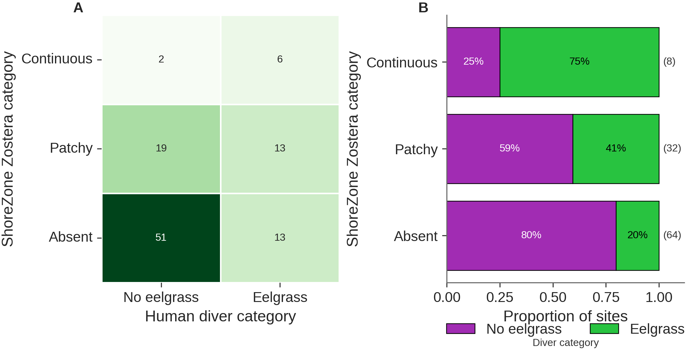
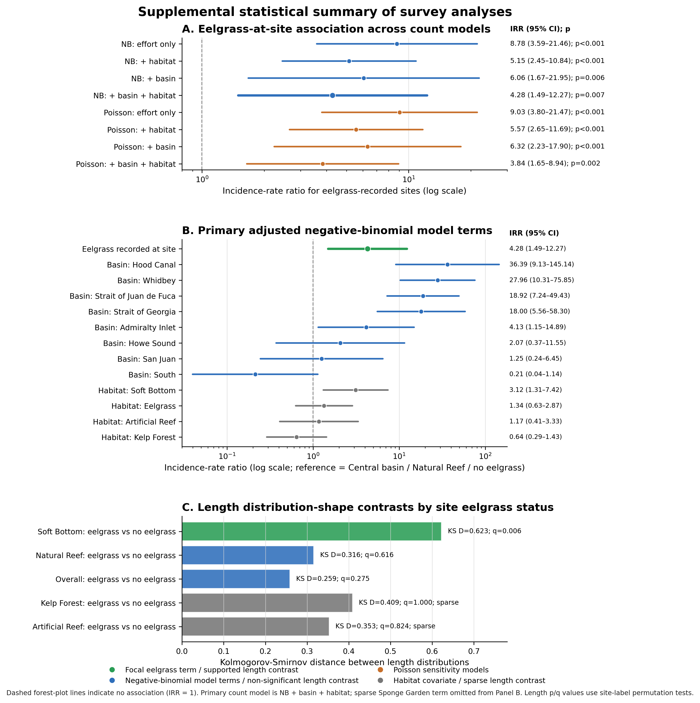

# StarMeadow

Reproducible publication materials for the StarMeadow analysis of sunflower sea star (*Pycnopodia helianthoides*) survey encounters, body-size distributions, eelgrass-associated habitat patterns, and ShoreZone habitat context in the Salish Sea.

This repository is intentionally publication-focused. It is not a complete archive of every exploratory analysis run during project development. The GitHub-facing surface is meant to be sparse, readable, and sharable: it keeps the code, data tables, figures, captions, statistical tables, and environment files that directly support the manuscript.

## Manuscript focus

The analysis asks where *P. helianthoides* were encountered during surveys and whether encounter rates and size distributions were associated with eelgrass-linked, protected shoreline habitats. The current manuscript emphasizes three linked results:

1. *P. helianthoides* encounters were unevenly distributed among surveyed sites and habitats.
2. Sites where eelgrass was recorded had higher expected encounter rates after accounting for survey effort, basin, and survey-level habitat.
3. A Whidbey Basin cluster of protected, continuously mapped eelgrass sites appears to be an especially important remaining/recovering concentration within the study area.

ShoreZone products are used as independent, older habitat-context layers, not as contemporaneous field truth. The ShoreZone source metadata report ground-condition dates from 1994-2000, with the Washington State ShoreZone Inventory published in 2001; these mapped layers pre-date the 2022-2025 surveys by roughly two decades.

## Repository layout

```text
StarMeadow/
├── README.md
├── ENVIRONMENT.md
├── code/
│   ├── figure_*.py                         # main manuscript figure scripts
│   ├── supplemental_figure_*.py            # supplemental figure scripts
│   ├── diver_only_stats_for_report.py      # survey count-model analysis
│   ├── length_distribution_shape_stats_for_report.py
│   ├── 15_shorezone_site_analysis.py       # retained ShoreZone preprocessing script
│   ├── 16_shorezone_recovery_analysis.py   # retained ShoreZone modeling script
│   ├── utils.py
│   └── shorezone_utils.py
├── data/
│   ├── PycnoCountCLean_12_31_2025.csv
│   ├── PycnoLengthCLean_12_31_2025.csv
│   ├── Site_LatLong.csv
│   └── state_DNR_ShoreZone/                # metadata only; full FileGDB not tracked
├── docs/
│   └── DATA_NOTES.md
├── scripts/
│   ├── build_publication_outputs
│   ├── run_pipeline
│   ├── analysis/
│   └── tables/
└── outputs/
    ├── 15_shorezone_site_analysis/         # minimal derived ShoreZone inputs
    ├── 16_shorezone_recovery_analysis/     # minimal derived ShoreZone inputs
    └── publication_figures/                # manuscript figures, captions, stats, tables
```

## Quick start

From the repository root:

```bash
/home/weertman/miniforge3/bin/conda env create -f code/environment.yml
./scripts/build_publication_outputs
```

If the environment already exists:

```bash
/home/weertman/miniforge3/bin/conda env update -n star_meadow -f code/environment.yml --prune
./scripts/build_publication_outputs
```

The build command runs the publication statistical analyses, figure scripts, ShoreZone summary script, and supplemental-table builders. Outputs are written under:

```text
outputs/publication_figures/
```

`./scripts/run_pipeline` is kept as a compatibility wrapper and calls the same publication-only build script.

## Environment

The intended environment is documented in `ENVIRONMENT.md` and specified in:

```text
code/environment.yml
```

On the analysis workstation, the canonical Conda executable is:

```text
/home/weertman/miniforge3/bin/conda
```

The expected environment name is:

```text
star_meadow
```

Do not run the analysis with bare system `python3`; the system Python on the analysis workstation lacks several required packages.

To verify the environment:

```bash
/home/weertman/miniforge3/bin/conda run -n star_meadow python --version
/home/weertman/miniforge3/bin/conda run -n star_meadow python - <<'PY'
import pandas, numpy, matplotlib, seaborn, scipy, sklearn, geopandas, fiona, pyproj, shapely, folium, joblib, statsmodels
print('StarMeadow environment ready')
PY
```

## Data files

Canonical manuscript input tables:

| File | Purpose |
|---|---|
| `data/PycnoCountCLean_12_31_2025.csv` | Survey-row count data used for encounter-rate and count-model analyses. |
| `data/PycnoLengthCLean_12_31_2025.csv` | Individual/row-level length data used for size-distribution analyses. |
| `data/Site_LatLong.csv` | Site coordinates used for mapping and spatial joins. |
| `data/state_DNR_ShoreZone/dnr_shorezone_metadata.xml` | Public ShoreZone metadata. |
| `data/state_DNR_ShoreZone/dnr_shorezone_metadata.html` | Human-readable ShoreZone metadata. |

Additional data notes and known quirks are documented in:

```text
docs/DATA_NOTES.md
```

Important coordinate note: `data/Site_LatLong.csv` contains exact site locations. Confirm sharing permissions before public release if exact locations are considered sensitive.

## ShoreZone data policy

The full Washington DNR ShoreZone FileGDB payload is not tracked in this sparse publication repository. Only metadata and the minimal derived products directly used by the manuscript are tracked.

Tracked derived ShoreZone products:

```text
outputs/15_shorezone_site_analysis/site_shorezone_pycno_summary.csv
outputs/15_shorezone_site_analysis/shorezone_ZOS_UNIT_proportions.csv
outputs/16_shorezone_recovery_analysis/feature_importance_permutation.csv
```

These files support the current ShoreZone figures, tables, and manuscript text. For long-term public reproducibility, the preferred next improvement is to add a concise ShoreZone preprocessing note or script that downloads/locates the public source data and regenerates these minimal derived products.

## Main figure scripts

| Figure | Script | Output examples |
|---|---|---|
| Fig 1 | `code/figure_1_site_map.py` | `outputs/publication_figures/submission/Fig1.tif` |
| Fig 2 | `code/figure_2_habitat_eelgrass_size.py` | `outputs/publication_figures/submission/Fig2.tif` |
| Fig 3 | `code/figure_3_basin_eelgrass_encounter_rate.py` | `outputs/publication_figures/submission/Fig3.tif` |
| Fig 4 | `code/figure_4_shorezone.py` | `outputs/publication_figures/submission/Fig4.tif` |

## Supplemental figure scripts

| Figure | Script | Output examples |
|---|---|---|
| S1 Fig | `code/supplemental_figure_1_effort_basin_map.py` | `outputs/publication_figures/submission/S1_Fig.tif` |
| S2 Fig | `code/supplemental_figure_2_length_by_habitat_eelgrass_status.py` | `outputs/publication_figures/submission/S2_Fig.tif` |
| S3 Fig | `code/supplemental_figure_3_continuous_eelgrass_map.py` | `outputs/publication_figures/submission/S3_Fig.tif` |
| S4 Fig | `code/supplemental_figure_4_shorezone_vs_diver_eelgrass.py` | `outputs/publication_figures/submission/S4_Fig.tif` |
| S5 Fig | `code/supplemental_figure_5_survey_statistical_summary.py` | `outputs/publication_figures/submission/S5_Fig.tif` |

Historical note: one script filename still contains `diver` from earlier drafts. The manuscript and figure language should use `survey`.

## Figures and captions

The manuscript figures are provided as PLOS-style TIFF files in `outputs/publication_figures/submission/`, with PNG/PDF source exports in `outputs/publication_figures/sources/`. Captions are maintained in `outputs/publication_figures/captions.md` so that figure images remain free of embedded manuscript text.

### Fig 1. Survey sites and *Pycnopodia* encounter rates in the Salish Sea



Map of survey sites. Circle color indicates whether eelgrass was recorded at the site during surveys; green sites had eelgrass recorded and purple sites had no eelgrass recorded. Circle size encodes the site-level mean *Pycnopodia* encounter rate in individuals per survey hour.

### Fig 2. Encounter rates and size distributions by habitat and eelgrass status



(A) Mean *Pycnopodia* encounter rate in individuals per survey hour across survey-transect habitat categories, ordered by the eelgrass-at-site mean encounter rate from highest to lowest. Non-eelgrass habitat categories are grouped by whether eelgrass was recorded at the site, while eelgrass transects are shown as a single eelgrass-at-site category. Whiskers show standard errors, and numbers in parentheses above bars indicate the number of survey rows underlying each mean. (B) Kernel density distributions of individual *Pycnopodia* lengths by site-level eelgrass status for all surveys split by presence or absence of eelgrass at the sites. Green indicates sites with eelgrass recorded during surveys, and purple indicates sites without eelgrass recorded.

### Fig 3. Encounter rates by basin and eelgrass status



Mean *Pycnopodia* encounter rate in individuals per survey hour by basin, with bars grouped by whether eelgrass was recorded at the site. Whiskers show standard errors, and numbers in parentheses above bars indicate the number of survey rows underlying each mean. Basins are ordered from left to right by the mean encounter rate for sites with eelgrass recorded, with the highest value shown first. Green indicates sites with eelgrass recorded during surveys, and purple indicates sites without eelgrass recorded.

### Fig 4. ShoreZone predictors and protected-exposure encounter rates



(A) Prediction loss from dropping individual ShoreZone features from the encounter-rate prediction model. Bars show the mean permutation prediction loss for each dropped feature, with whiskers showing standard errors. Features are ordered by prediction loss, with the largest loss at the top. (B) Mean site-level *Pycnopodia* encounter rate in individuals per survey hour by ShoreZone exposure category and continuous eelgrass status. Protected / very protected sites are those with ShoreZone exposure class P or VP; other exposure includes all remaining ShoreZone exposure classes. Green bars indicate ShoreZone continuous eelgrass, and purple bars indicate other eelgrass states or no mapped continuous eelgrass. Whiskers show standard errors, and numbers in parentheses above bars indicate the number of sites underlying each mean.

### S1 Fig. Survey effort and basin assignments across the Salish Sea study area



Map of the survey sites. Circle color indicates the geographic basin assigned to each site, and circle size encodes total survey effort in hours at that site.

### S2 Fig. Individual size distributions by survey-level habitat and site-level eelgrass status



Kernel density distributions of individual *Pycnopodia* lengths by recorded survey-level habitat for (A) sites where eelgrass was recorded and (B) sites where eelgrass was not recorded. Both panels use the same x- and y-axis limits. Numbers in the legend indicate the number of individual length observations contributing to each habitat-specific density curve.

### S3 Fig. ShoreZone eelgrass categories and *Pycnopodia* encounter rates



Map of survey sites colored by ShoreZone Zostera category and sized by site-level mean *Pycnopodia* encounter rate in individuals per survey hour. Green indicates continuous mapped ShoreZone eelgrass, gold indicates patchy mapped eelgrass, purple indicates mapped absence of eelgrass, and gray indicates sites without a ShoreZone Zostera match. ShoreZone categories are mapped habitat context rather than contemporaneous survey observations.

### S4 Fig. ShoreZone and survey-recorded eelgrass classifications



Comparison of site-level ShoreZone Zostera categories and survey-recorded eelgrass categories for sites with a ShoreZone match. Survey-recorded eelgrass status indicates whether eelgrass was recorded in any survey row at a site. (A) Heatmap of site counts in each ShoreZone-by-survey category combination. (B) Proportion of sites within each ShoreZone category where eelgrass was or was not recorded during surveys; parenthetical values indicate the number of matched survey sites in each ShoreZone category.

### S5 Fig. Statistical summary of survey analyses



(A) Eelgrass-at-site incidence-rate ratios from negative-binomial count models and Poisson sensitivity models. Points show estimates, bars show 95% confidence intervals, and the dashed line indicates no association. (B) Terms from the primary negative-binomial model adjusted for basin and survey-level habitat, with incidence-rate ratios shown relative to no eelgrass recorded at the site, Central basin, and Natural Reef habitat. (C) Length distribution-shape contrasts summarized by Kolmogorov-Smirnov distance. Green indicates the supported Soft Bottom contrast, blue indicates non-significant non-sparse contrasts, and gray indicates sparse descriptive contrasts.

## Statistical analyses

Survey count-model analysis:

```text
code/diver_only_stats_for_report.py
```

This script generates negative-binomial count models and Poisson sensitivity models, using survey duration as an effort offset and site-clustered standard errors. The main manuscript reports coefficients as incidence-rate ratios (IRRs).

Length distribution-shape analysis:

```text
code/length_distribution_shape_stats_for_report.py
```

This script generates site-aware and descriptive length-distribution contrasts used by the manuscript, S2 Fig, S5 Fig, and supplemental tables.

ShoreZone statistical summary:

```text
scripts/analysis/shorezone_stats_for_report.py
```

This script summarizes the ShoreZone model and group comparisons used in Fig 4, S3 Fig, S4 Fig, S5-related text, and supplemental tables.

Primary statistical outputs are written to:

```text
outputs/publication_figures/stats/
outputs/publication_figures/qc/shorezone_report_stats/   # generated locally; not tracked by default
```

## Supplemental statistical tables

The combined supplemental table file is:

```text
outputs/publication_figures/supplemental_tables/supplemental_statistical_tables.md
```

Tracked table CSVs:

```text
outputs/publication_figures/supplemental_tables/table_s1_survey_analysis_input_summary.csv
outputs/publication_figures/supplemental_tables/table_s2_count_model_eelgrass_association.csv
outputs/publication_figures/supplemental_tables/table_s3_primary_count_model_terms.csv
outputs/publication_figures/supplemental_tables/table_s4_descriptive_cells_and_sparse_flags.csv
outputs/publication_figures/supplemental_tables/table_s5_length_distribution_shape_tests.csv
outputs/publication_figures/supplemental_tables/table_s6a_shorezone_model_summary.csv
outputs/publication_figures/supplemental_tables/table_s6b_shorezone_top_prediction_loss_features.csv
outputs/publication_figures/supplemental_tables/table_s7a_shorezone_fig4b_group_summary.csv
outputs/publication_figures/supplemental_tables/table_s7b_shorezone_fig4b_tests.csv
outputs/publication_figures/supplemental_tables/table_s7c_shorezone_eelgrass_agreement_tests.csv
```

Table-building scripts:

```text
scripts/tables/build_supplemental_statistical_tables.py
scripts/tables/build_doc_friendly_supplemental_tables.py
scripts/tables/build_docx_supplemental_tables.py
scripts/tables/build_google_docs_copy_paste_html.py
```

The Google Docs copy-paste HTML outputs are useful for manuscript drafting but are intentionally not tracked.

## Captions and manuscript-facing outputs

Captions are kept separately from figure images:

```text
outputs/publication_figures/captions.md
```

PLOS-style submission TIFFs are in:

```text
outputs/publication_figures/submission/
```

Editable/source PNG/PDF versions are in:

```text
outputs/publication_figures/sources/
```

## Rebuilding individual components

Run one script at a time with the Conda environment:

```bash
/home/weertman/miniforge3/bin/conda run -n star_meadow python code/figure_1_site_map.py
/home/weertman/miniforge3/bin/conda run -n star_meadow python code/diver_only_stats_for_report.py
/home/weertman/miniforge3/bin/conda run -n star_meadow python scripts/tables/build_supplemental_statistical_tables.py
```

Or rebuild the full publication surface:

```bash
./scripts/build_publication_outputs
```

## What is intentionally excluded from GitHub

The `.gitignore` is strict by design. It keeps local research history available on the analysis machine while preventing older or private material from becoming part of the public publication repository.

Excluded from the GitHub-facing surface:

- older exploratory scripts from the numbered pre-publication pipeline
- older generated outputs under `outputs/01_*` through older analysis folders
- the full ShoreZone FileGDB payload
- internal manuscript drafts and collaborator planning notes
- local QC/check/audit files
- Google Docs copy-paste helper HTML/TSV/DOCX outputs
- caches, logs, archives, local agent files, and operating-system cruft

If a file is needed for the paper and is ignored, move it into one of the publication-facing paths or adjust `.gitignore` intentionally rather than force-adding ad hoc files.

## Reproducibility status

Current status:

- publication figure scripts are tracked
- final publication figure outputs are tracked
- supplemental statistical tables are tracked
- old exploratory pipeline code and outputs are not tracked on the publication branch
- minimal derived ShoreZone inputs are tracked
- full ShoreZone source data are not tracked

Known reproducibility caveat:

The current repository contains derived ShoreZone inputs rather than the full third-party ShoreZone geodatabase. This keeps the repository small and publication-focused, but a fully independent public rerun from raw ShoreZone source data would require restoring or documenting the ShoreZone preprocessing step.

## Citation and license

Citation and license information should be added before public release, after the manuscript target, data-sharing permissions, and repository visibility are finalized.
